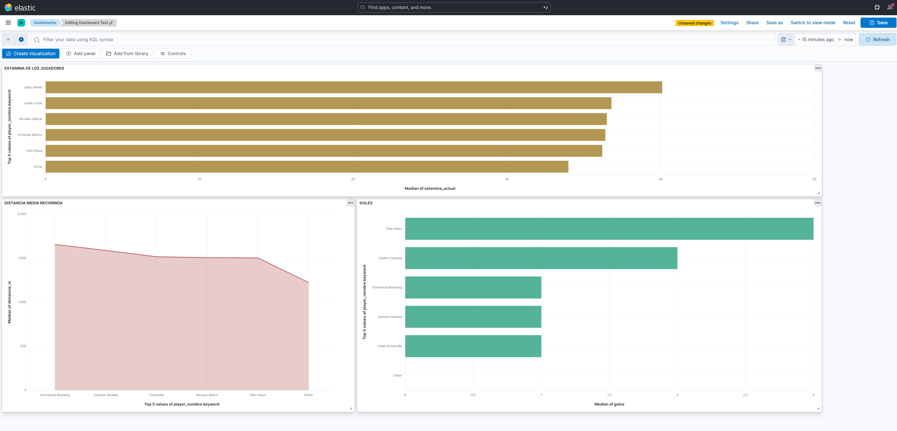

# ⚽ Real-Time Football Analytics: Ecosistema Big Data

Este repositorio contiene la implementación de una arquitectura Big Data integral (combinando enfoques Batch y Streaming) diseñada para analizar el rendimiento de jugadores de fútbol en tiempo real. 

El objetivo principal es simular el entorno de un equipo técnico deportivo que necesita tomar decisiones tácticas inmediatas (por ejemplo, sustituciones por fatiga) procesando métricas estáticas e integrándolas con eventos de partido generados en streaming.

---

## 🛠️ Stack Tecnológico

Todo el ecosistema está contenerizado y orquestado mediante **Docker**, utilizando las siguientes herramientas clave:

| Capa | Tecnologías | Propósito |
| :--- | :--- | :--- |
| **Almacenamiento Base** | HDFS (NameNode, DataNode), YARN | Data Lake distribuido. Almacenamiento histórico en formato Parquet. |
| **Ingesta (Streaming)** | Apache Kafka | Bus de mensajería de alta disponibilidad para eventos en tiempo real. |
| **Procesamiento (ETL)** | Apache Spark, PySpark | Motores de cálculo masivo para procesamiento Batch y Structured Streaming. |
| **Indexación Rápida** | Elasticsearch | Base de datos documental de baja latencia para analítica en vivo. |
| **Visualización (BI)** | Kibana, Grafana | Creación de Dashboards interactivos para la toma de decisiones. |
| **Monitorización** | Prometheus, Portainer, Traefik, Kafbat | Control de salud de contenedores, red, y gestión visual de topics. |

---

## 📊 Origen y Naturaleza de los Datos

El sistema se alimenta de dos flujos de datos distintos que se cruzan y complementan durante el procesamiento:

### 1. Datos Estáticos (Archivos Batch)
Utilizamos datasets reales de la saga FIFA (`Men_Players.csv` y `Women_Players.csv`) almacenados inicialmente en HDFS. Estos archivos definen las características base de los jugadores al inicio del partido:
*   **Perfil Base:** Equipo, posición, nombre y nacionalidad.
*   **Físico (PHY):** Define la "estamina" o energía inicial (100%), la cual se degrada según la distancia recorrida en el campo.
*   **Habilidad (PAS, SHO):** Probabilidades base de éxito al intentar realizar pases y tiros a puerta.
*   **Defensa (DEF):** Probabilidad de éxito al intentar robar el balón al equipo contrario.

### 2. Datos Sintéticos (Streaming en Vivo)
El script `streaming_generator.py` actúa como el motor de simulación del partido:
*   Genera dos equipos aleatorios garantizando una alineación táctica realista de 4-4-2.
*   Asigna un `match_id` único por partido para asegurar la correcta trazabilidad en el histórico de datos.
*   Simula dinámicamente el movimiento espacial de los jugadores (coordenadas X, Y) y el flujo de la posesión del balón.
*   Emite eventos JSON a un topic de Kafka (`football_events`) a intervalos de 2 segundos.

---

## ⚙️ Arquitectura ETL y Procesamiento

El núcleo analítico está desarrollado en **Apache Spark (PySpark)** y se divide en dos fases fundamentales:

### Fase 1: ETL Batch (`batch_etl.py`)
Proceso ejecutado al inicializar el entorno para preparar los datos maestros.
*   **Extracción:** Lectura de los archivos CSV en crudo alojados en HDFS.
*   **Transformación:** Limpieza de columnas irrelevantes (ej. URLs de avatares), unificación de los datasets masculino y femenino, e inyección de la métrica de estamina inicial al 100%.
*   **Carga:** Guardado del dataset resultante de vuelta en HDFS utilizando **Parquet**, un formato columnar altamente optimizado para consultas Big Data.

### Fase 2: ETL Streaming (`streaming_etl.py`)
Proceso de ejecución continua que ingiere y procesa el topic de Kafka durante el transcurso del partido simulado.
*   **Cálculo de Acciones:** Evalúa probabilísticamente el éxito o fracaso de las acciones (pases, tiros, robos) cruzando el evento en vivo con la estadística base estática del jugador correspondiente.
*   **Degradación Física:** Calcula la distancia euclidiana recorrida mediante la variación de coordenadas (X, Y) y penaliza la métrica de estamina en consecuencia.
*   **Agregación:** Mantiene un estado temporal en memoria para calcular las métricas totales y acumuladas por cada jugador.
*   **Doble Salida (Dual Sink):** 
    *   **Cold Storage:** Escribe en HDFS (Parquet) para persistencia histórica y auditoría a largo plazo.
    *   **Hot Storage:** Escribe en Elasticsearch mediante micro-batches (cada 10s) para inyectar datos de forma inmediata en los paneles de visualización.

> **💡 Nota de Arquitectura:** La inclusión de Elasticsearch en este ecosistema responde a un objetivo de investigación orientado a comparar la experiencia de desarrollo y rendimiento de Dashboards en Kibana frente al flujo tradicional con Grafana. Kibana requiere Elasticsearch como motor de indexación subyacente para funcionar.

---

## 📈 Business Intelligence y Toma de Decisiones

La culminación del pipeline de datos se materializa en los paneles visuales de **Grafana** y **Kibana**, traduciendo datos crudos en información accionable para el cuerpo técnico:

*   **Gestión de Sustituciones:** Monitorización del nivel de estamina en tiempo real para identificar y sustituir a jugadores con riesgo de agotamiento inminente.
*   **Análisis Táctico Espacial:** Generación de mapas de calor e identificación de las zonas de mayor permanencia (defensa, medio, ataque) para ajustar la formación.
*   **Rendimiento Individual:** Análisis de ratios de eficacia en pases, bloqueos, robos clave y precisión de tiro a puerta.
*   **Ajustes de Entrenamiento:** Identificación de jugadores con tasas de degradación física anómalas respecto a la media del equipo para derivarlos a sesiones de preparación física específica.

---

## 🚀 Despliegue y Ejecución

Para levantar toda la infraestructura localmente, inicializar los servicios y poner en marcha tanto la simulación como el procesamiento, consulta el manual detallado de ejecución.

👉 **[Consultar la guía paso a paso (Ejecucion.md)](./Ejecucion.md)**